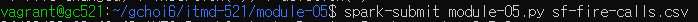
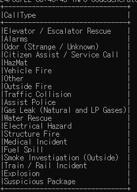
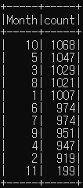
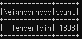
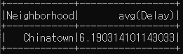
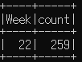
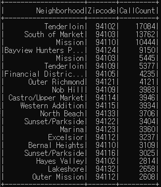
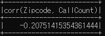
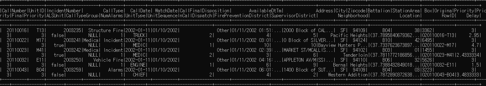

# 🚒 San Francisco Fire Calls Analysis with PySpark

This project uses **PySpark** to analyze San Francisco fire calls data. The analysis demonstrates a full, end-to-end data processing workflow using Spark DataFrames, addressing key questions related to call types, seasonal trends, neighborhood response times, and other statistical insights.

## 📄 Overview
This project aims to explore various statistical questions using a PySpark application based on the **sf-fire-calls.csv** dataset. Each question is addressed with Spark DataFrame operations, showing the power of PySpark for large-scale data analysis.

## 💻 Running the Project
Make sure the `sf-fire-calls.csv` file is in the same directory as the code file. You can download the dataset from the following link:

[Download the sf-fire-calls.csv dataset](https://github.com/databricks/LearningSparkV2/tree/master/databricks-datasets/learning-spark-v2/sf-fire)

Execute the following command to run the analysis:
```bash
spark-submit fire_calls_analysis.py sf-fire-calls.csv
```


## 🔍 Analysis Questions & Results

1. **What were all the different types of fire calls in 2018?**
   ```python
   fire_df_2018.select("CallType").where(col("CallType").isNotNull()).distinct().show(truncate=False)
   ```
   

2. **Which months in 2018 had the highest number of fire calls?**
   ```python
   fire_df_2018.groupBy(month(col("CallDate")).alias("Month")).count().orderBy("count", ascending=False).show()
   ```
   

3. **Which neighborhood in San Francisco generated the most fire calls in 2018?**
   ```python
   fire_df_2018.groupBy("Neighborhood").count().orderBy("count", ascending=False).show(1)
   ```
   

4. **Which neighborhoods had the worst response times to fire calls in 2018?**
   ```python
   fire_df_2018.groupBy("Neighborhood").agg({"Delay": "avg"}).orderBy("avg(Delay)", ascending=False).show(1)
   ```
   

5. **Which week in 2018 had the most fire calls?**
   ```python
   fire_df_2018.groupBy(weekofyear(col("CallDate")).alias("Week")).count().orderBy("count", ascending=False).show(1)
   ```
   

6. **Is there a correlation between neighborhood, zip code, and the number of fire calls?**
   ```python
   neighborhood_zip_count = fire_df.groupBy("Neighborhood", "Zipcode").agg(count("CallNumber").alias("CallCount")).orderBy("CallCount", ascending=False)
   neighborhood_zip_count.show()
   neighborhood_zip_count.select(corr("Zipcode", "CallCount")).show()
   ```
     
   

7. **How can we use Parquet files or SQL tables to store this data and read it back?**
   - **Parquet**: Data is saved and loaded using the Parquet format.
   - **SQL Table**: Data is stored in a Spark SQL table for querying.
   ```python
   fire_df.write.mode("overwrite").parquet("sf_fire_calls.parquet")
   fire_df_parquet = spark.read.parquet("sf_fire_calls.parquet")
   fire_df_parquet.show(5)

   fire_df.write.mode("overwrite").saveAsTable("FireCallsSQLTable")
   sql_result = spark.sql("SELECT * FROM FireCallsSQLTable")
   sql_result.show(5)
   ```
   

## 🔎 Summary
This project showcases how to leverage PySpark for analyzing a large dataset on fire calls, extracting valuable insights regarding call types, timing, response delays, and neighborhood-specific statistics.

## 📝 Notes
- This project was executed on a local Spark cluster.
- The dataset file, `sf-fire-calls.csv`, should be provided as a command-line argument.